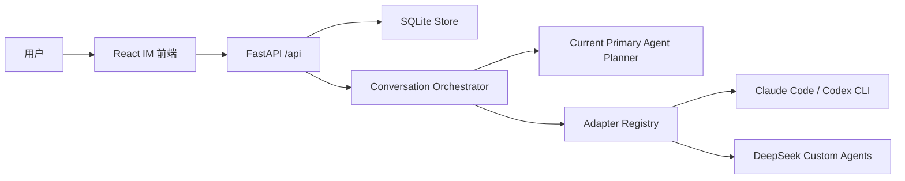

# AgentHub 技术文档

## 架构



## 后端

- FastAPI 提供 REST API 和 SSE 事件流。SSE 会推送消息新增与同一消息的内容/状态更新。
- SQLite 保存 Agent、Conversation、Message、Artifact。
- `Store` 封装持久化、默认 Agent 数据和会话成员快照迁移。
- 单聊直接调用唯一成员；群聊通过当前主 Agent 对应的 Adapter 和会话级 System Prompt 形成结构化计划，再按计划顺序调用成员。
- 计划消息按顺序 `@Agent` 并声明当前会话项目目录；文件任务只分配给具备文件工具的 CLI Agent。
- 规划失败时使用本地路由降级；执行失败时将任务转交给其他成员，优先选择可用 CLI Agent。
- `AdapterRegistry` 隔离 Agent 平台差异，Claude Code 与 Codex 通过本机 CLI 非交互执行，自建 Agent 通过 DeepSeek API 执行。

## API 概览

- `GET /api/agents`：获取 Agent 联系人。
- `GET /api/contacts`：只获取可复用的联系人 Agent。
- `POST /api/agents`：创建用户自建 Agent。
- `DELETE /api/contacts/{agent_id}`：从联系人移除非内置 Agent，不删除历史会话或成员快照。
- `GET /api/conversations`：查询会话列表，按置顶和更新时间排序。
- `POST /api/conversations`：创建单聊或群聊。
- `GET /api/conversations/{id}`：读取会话和消息。
- `PATCH /api/conversations/{id}`：修改标题或会话成员。
- `POST /api/conversations/{id}/members`：从联系人添加群聊成员。
- `PATCH /api/conversations/{id}/members/{agent_id}`：修改会话级成员属性或切换主 Agent。
- `DELETE /api/conversations/{id}`：永久删除会话及消息。
- `POST /api/conversations/{id}/messages`：发送用户消息并触发 Agent 回复。
- `PATCH /api/conversations/{id}/pinned`：置顶会话。
- `PATCH /api/conversations/{id}/archived`：归档会话。
- `PATCH /api/messages/{id}/pinned`：置顶消息为长期上下文。
- `PATCH /api/conversations/{id}/messages/{message_id}/artifacts/{artifact_id}`：更新 Diff 等产物状态。

## 数据模型

- `Agent`：联系人默认名称、头像、provider、kind、能力标签、功能说明、system prompt、联系人状态、内置标记、工具集、健康状态。
- `Conversation`：标题、单聊/群聊模式、成员 Agent、置顶/归档、最近活跃时间。
- `ConversationMember`：Agent 在指定会话中的名称、职责、System Prompt、顺序和主 Agent 标记。
- `Message`：角色、发送者、正文、引用、置顶状态、产物列表、流式状态和更新时间。
- `Artifact`：类型、标题、内容、语言、状态。

## 真实 Agent 接入

真实集成不改变 Orchestrator。新增适配器只需要实现：

```python
send_message(context: list[Message], agent: Agent, user_prompt: str) -> AgentResponse
```

当前接入：

- System Agent：DeepSeek API，默认联系人和群聊主 Agent。
- Claude Code：`claude --print --permission-mode acceptEdits`。
- Codex：`codex exec --sandbox workspace-write`。
- 自建 Agent：DeepSeek `v1/chat/completions`，配置来自项目根目录 `.env`。

每次执行都把完整历史和置顶消息传入 Adapter。后一个 Agent 会读取前一个 Agent 已写入会话的回复，
保证计划中的任务按顺序衔接。会话级属性由 `conversation_members` 保存，不回写 `agents` 联系人表。

CLI 适配器读取本机登录态，并自动检查 PATH、Homebrew 常见位置和 Codex.app 内置 CLI。也可通过
`CLAUDE_CLI_PATH`、`CODEX_CLI_PATH` 显式覆盖。API 适配器读取环境变量。缺少 CLI、登录态或
DeepSeek Key 时，Agent 会在聊天流中返回可操作错误说明。

DeepSeek HTTPS 请求通过 `truststore` 使用操作系统原生证书库，避免 macOS 系统证书与
Python/OpenSSL CA 集不一致导致的 `CERTIFICATE_VERIFY_FAILED`。Orchestrator 会保留认证、
权限、网络、证书和响应格式错误的具体原因，再执行本地规则降级。

## 流式输出

- Orchestrator 在执行 Agent 前创建 `streaming=true` 的空消息。
- Claude Code 使用 `stream-json`，Codex 使用 `--json`，DeepSeek 使用 Chat Completions SSE。
- Claude Code 与 Codex 的完整提示通过 stdin 传入，避免聊天历史超过操作系统命令行参数长度。
- CLI 初始化事件、思考增量和原始 JSON 错误不会写入聊天，只保留用户可操作的文本结果或简洁错误摘要。
- 每个文本片段通过回调更新 SQLite 中的同一条消息。
- 会话 SSE 每 250ms 检测 `updated_at`、`streaming` 和正文长度变化并推送。
- 前端使用 `react-markdown` 与 `remark-gfm` 渲染标题、表格、列表、引用和代码块。

## 项目目录

每个会话对应：

```text
projects/{conversation_id}/
```

创建会话时初始化目录。Claude Code 的工作目录与 `--add-dir`、Codex 的 `--cd` 和
`workspace-write` 沙箱都指向该目录。系统提示要求代码、文本、规范和协作文档等所有产物
不得写入父目录。DeepSeek API Agent 的成功文本结果由 Orchestrator 自动归档到该目录。
